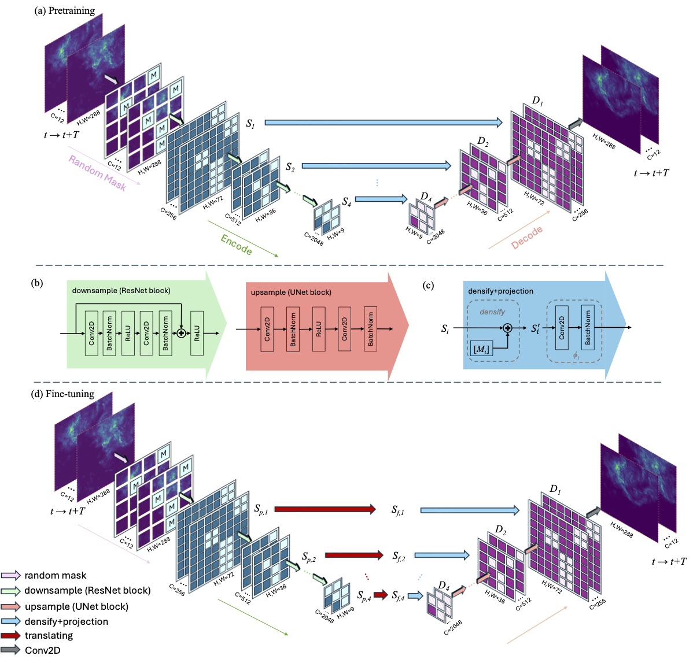

# Self-supervised Spatialtemporal Learner for Precipitation Nowcasting

## Description

SpaT-SparK is a self-supervised learning model for precipitation nowcasting.
SpaT-SparK extends SparK to be tailored to nowcasting tasks.
The results show that our model outperforms other exisiting end-to-end machine learning models.



## Dataset

The precipitation map data is acquired from [KNMI Data Platform](https://dataplatform.knmi.nl/). The preprocessing process is the same as that in paper [SmaAt-UNet: Precipitation nowcasting using a small attention-UNet architecture](https://www.sciencedirect.com/science/article/pii/S0167865521000556?via%3Dihub) ([GitHub](https://github.com/HansBambel/SmaAt-UNet)). The NL-50 dataset is used in this work.

## Performance

The performance is evaluated on NL-50 dataset.

| Model         | pMSE ↓  | Accuracy ↑ | Precision ↑ | Recall ↑ | F1 ↑   | CSI ↑  | FAR ↓  | HSS ↑  |
|---------------|---------|------------|-------------|----------|--------|--------|--------|--------|
| SmaAt-UNet    | 0.0145  | 0.774      | 0.631       | **0.846**| **0.723** | **0.566** | 0.368  | **0.269** |
| SparK(ResNet-50)     | 0.0136  | 0.911      | 0.646       | 0.520    | 0.543  | 0.373  | 0.353  | 0.245  |
| SparK(ResNet-18)     | 0.0139  | 0.910      | 0.620       | 0.444    | 0.512  | 0.344  | 0.379  | 0.232  |
| SpaT-SparK (ResNet-50)     | 0.0135  | 0.911      | 0.633       | 0.486    | 0.528  | 0.359  | 0.366  | 0.239  |
| SpaT-SparK (ResNet-18)     | **0.0132** | **0.913** | **0.678**   | 0.588    | 0.560  | 0.389  | **0.321** | 0.255  |


## Installation

1. Follow the [dependency installing instructions](https://github.com/keyu-tian/SparK?tab=readme-ov-file#installation--running) of SparK
2. Install the packages from `pretrain/requirements.txt`:

```shell script
$ cd source
$ pip install -r requirements.txt
```

The runs are excuted via [SLURM](https://slurm.schedmd.com/documentation.html) and [Submitit](https://github.com/facebookincubator/submitit).
The monitored results are recorded by [Neptune](https://neptune.ai/), also set up the configs for Neptune.

## Pretraining and Fine-tuning

- **Pretraining**

  ```bash
  cd source
  python submitit_pretrain.py \
    --is_pretraining \
    --exp_name resnet18_chan12 \
    --partition gpu \
    --nodes 1 \
    --ngpus 1 \
    --model resnet18_chan12 \
    --in_channels 12 \
    --bs 128 \
    --mask 0.3 \
    --ep 1600 \
    --wp_ep 40 \
    --base_lr 2e-4 \
    --weight_decay 0.05
  ```

- **Fine-tuning**
  ```bash
  cd source
  python submitit_finetune.py \
    --exp_name resnet18c12_linear_no_fr \
    --partition gpu \
    --mem_per_task 20 \
    --cpu_per_task 1 \
    --nodes 1 \
    --ngpus 1 \
    --model resnet18_chan12 \
    --in_channels 12 \
    --bs 196 \
    --mask 0.6 \
    --ep 1600 \
    --wp_ep 40 \
    --base_lr 2e-4 \
    --weight_decay 0.05 \
    --densify_norm bn \
    --freeze no \
    --init_weight [PRETRAINED_MODEL] \
    --datamode CHW \
    --transition linearA
    ```


## Acknowledgement

The code is developed based on [SparK](https://github.com/keyu-tian/SparK).

Correspondence: Siamak Mehrkanoon s.mehrkanoon@uu.nl

## License

This project is under the MIT license. See [LICENSE](LICENSE) for more details.

## Citation

If you find this work helpful, please cite the paper:

```
@Article{
}
```